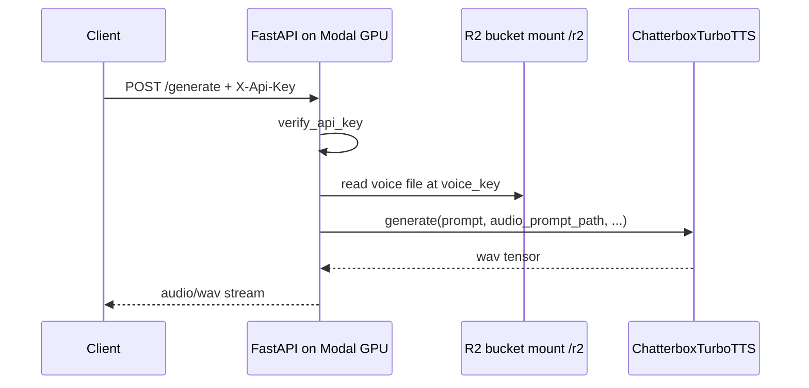

# Chatterbox TTS on Modal

This document explains [`chatterbox_tts.py`](../chatterbox_tts.py) — a **serverless GPU service** on [Modal](https://modal.com) that exposes a **FastAPI** HTTP API for **Chatterbox text-to-speech with voice cloning**.

If you come from **Node.js / Express / NestJS**, the mental model is:

| This file | Node analogy |
|-----------|--------------|
| `modal.App` + `image` | Dockerfile + deploy config (Lambda/container image) |
| `Chatterbox` class | A NestJS `@Injectable()` service living on a GPU worker |
| `@modal.asgi_app()` | Mounting Express/Fastify as the HTTP layer on that worker |
| `@modal.method()` | An internal RPC you can call from other Modal code |
| `modal run ...` | `npm run` a one-off script against deployed infra |

---

## Big picture: request flow



1. Client sends JSON (`prompt`, `voice_key`, sampling params).
2. API key is checked globally.
3. Voice sample is loaded from **Cloudflare R2** mounted at `/r2`.
4. GPU model generates speech.
5. Response is a **WAV file stream**.

---

## Section by section

### 1. Docstring and comments

The top of the file documents:

- How to create Modal secrets (R2 credentials).
- How to run locally: `modal run chatterbox_tts.py --prompt "..." --voice-key "..."`
- How to call the deployed API with `curl`.

### 2. R2 storage mount

```python
R2_BUCKET_NAME = "resonance-ai"
R2_MOUNT_PATH = "/r2"
r2_bucket = modal.CloudBucketMount(
    R2_BUCKET_NAME,
    bucket_endpoint_url=f"https://{R2_ACCOUNT_ID}.r2.cloudflarestorage.com",
    secret=modal.Secret.from_name("cloudflare-r2"),
    read_only=True,
)
```

**What it does:** Mounts the Cloudflare R2 bucket into the container at `/r2`, read-only.

**Node analogy:** Like mounting S3 as a filesystem in the container. Paths look like normal files, e.g. `/r2/voices/system/foo.wav`.

Credentials come from the Modal secret `cloudflare-r2` (similar to env vars injected at deploy time).

Create the secret:

```bash
modal secret create cloudflare-r2 \
  AWS_ACCESS_KEY_ID=<r2-access-key-id> \
  AWS_SECRET_ACCESS_KEY=<r2-secret-access-key>
```

### 3. Container image and app

```python
image = modal.Image.debian_slim(python_version="3.10").uv_pip_install(
    "chatterbox-tts==0.1.6",
    "fastapi[standard]==0.124.4",
    "peft==0.18.0",
)
app = modal.App("chatterbox-tts", image=image)
```

**What it does:** Defines the Linux image and Python dependencies for every Modal function in this file.

**Node analogy:** `FROM node:20` plus `package.json` dependencies, baked into the deploy artifact.

### 4. `with image.imports():`

```python
with image.imports():
    import torchaudio as ta
    from chatterbox.tts_turbo import ChatterboxTurboTTS
    from fastapi import FastAPI, Depends, ...
    from pydantic import BaseModel, Field
```

Heavy imports (`torchaudio`, `chatterbox`, FastAPI) run **inside the remote container**, not necessarily on your laptop when you edit the file. Modal uses this pattern so local `modal run` / deploy analysis stays fast.

#### `TTSRequest` (Pydantic)

Request body DTO with validation — like a NestJS DTO plus `class-validator`:

```typescript
// Nest-ish equivalent
class TTSRequest {
  @IsString() @Length(1, 5000) prompt: string;
  @IsString() voice_key: string;
  @IsOptional() @Min(0) @Max(2) temperature = 0.8;
  // ...
}
```

- `Field(...)` — required field.
- `Field(default=0.8, ge=0.0, le=2.0)` — optional with min/max bounds.

| Field | Purpose |
|-------|---------|
| `prompt` | Text to speak (1–5000 chars) |
| `voice_key` | Path inside R2 mount, e.g. `voices/system/<id>.wav` |
| `temperature`, `top_p`, `top_k`, `repetition_penalty` | Sampling / generation controls |
| `norm_loudness` | Whether to normalize output loudness |

#### `verify_api_key`

Global auth guard:

| FastAPI | NestJS |
|---------|--------|
| `APIKeyHeader(name="x-api-key")` | Reading `X-Api-Key` header |
| `Security(api_key_scheme)` | `@Headers('x-api-key')` |
| `dependencies=[Depends(verify_api_key)]` on app | `@UseGuards(ApiKeyGuard)` globally |
| `HTTPException(403)` | `throw new ForbiddenException()` |

Expected key: environment variable `CHATTERBOX_API_KEY` from Modal secret `chatterbox-api-key`.

---

### 5. The `Chatterbox` class (core service)

```python
@app.cls(
    gpu="a10g",
    scaledown_window=60 * 5,
    secrets=[...],
    volumes={R2_MOUNT_PATH: r2_bucket},
)
@modal.concurrent(max_inputs=10)
class Chatterbox:
```

A **long-lived GPU worker class**, not a plain serverless function.

| Decorator / option | Meaning |
|--------------------|---------|
| `gpu="a10g"` | Runs on NVIDIA A10G |
| `scaledown_window=60 * 5` | Idle ~5 minutes, then scale down (cost control) |
| `secrets=[...]` | Inject HF token, API key, R2 credentials |
| `volumes={...}` | Mount R2 at `/r2` |
| `@modal.concurrent(max_inputs=10)` | Up to 10 concurrent requests per container |

**Node analogy:** A warm GPU pod with env secrets and a volume — closer to a Kubernetes Deployment than a stateless Lambda.

#### `@modal.enter()` — startup hook

```python
@modal.enter()
def load_model(self):
    self.model = ChatterboxTurboTTS.from_pretrained(device="cuda")
```

Runs **once** when the container starts — like `onModuleInit()` loading a heavy ML model so you do not reload it on every request.

#### `@modal.asgi_app()` — HTTP server

```python
@modal.asgi_app()
def serve(self):
    web_app = FastAPI(
        dependencies=[Depends(verify_api_key)],
    )
```

**ASGI** is Python’s async HTTP server interface (similar to how Express sits on `http.createServer`). Modal hosts this app and gives you a public URL.

**FastAPI vs Express:**

| FastAPI | Express |
|---------|---------|
| `web_app = FastAPI()` | `const app = express()` |
| `@web_app.post("/generate")` | `app.post("/generate", ...)` |
| `request: TTSRequest` | Body parsed and validated (like Zod middleware) |
| `HTTPException(400)` | `res.status(400).json({ ... })` |
| `StreamingResponse(...)` | `res.type('audio/wav').send(buffer)` |
| `CORSMiddleware` | `cors()` middleware |
| Auto `/docs` | Swagger UI (built in) |

**Route handler (`POST /generate`):**

1. Build path: `/r2` + `voice_key`.
2. Return `400` if the voice file does not exist.
3. Call `self.generate.local(...)` — runs the `@modal.method()` **in-process** on the same GPU container (no extra network hop).
4. Return WAV bytes as `StreamingResponse` with `media_type="audio/wav"`.

#### `@modal.method()` — inference

```python
@modal.method()
def generate(self, prompt: str, audio_prompt_path: str, ...):
    wav = self.model.generate(prompt, audio_prompt_path=audio_prompt_path, ...)
    buffer = io.BytesIO()
    ta.save(buffer, wav, self.model.sr, format="wav")
    return buffer.read()
```

Runs the model, encodes audio to WAV in memory, returns raw `bytes`.

- `.local()` — call in-process on the same container.
- `.remote()` — RPC to a Modal worker (used from the CLI test entrypoint).

---

### 6. Local test entrypoint

```python
@app.local_entrypoint()
def test(prompt: str = "...", voice_key: str = "...", ...):
    chatterbox = Chatterbox()
    audio_bytes = chatterbox.generate.remote(...)
```

CLI when you run:

```bash
modal run chatterbox_tts.py \
  --prompt "Hello from Chatterbox [chuckle]." \
  --voice-key "voices/system/<voice-id>"
```

`@app.local_entrypoint()` is like `if (require.main === module)` in Node. `generate.remote()` runs inference on Modal’s GPU (not your laptop), unless you configure local GPU development.

---

## Python syntax cheat sheet (used in this file)

| Syntax | Meaning |
|--------|---------|
| `str \| None` | `string \| null` (Python 3.10+ unions) |
| `def foo(self, ...)` | Instance method; `self` is like `this` |
| `class Foo:` | Class definition |
| `with image.imports():` | Modal-specific import scope |
| `io.BytesIO()` | In-memory buffer (like Node `Buffer`) |
| `pathlib.Path` | Path helper |
| `@decorator` | Like Nest `@Injectable()` / route decorators |

---

## Calling the API

From your Next.js app or any HTTP client:

```http
POST https://<your-modal-endpoint>/generate
X-Api-Key: <your-api-key>
Content-Type: application/json

{
  "prompt": "Hello [chuckle].",
  "voice_key": "voices/system/<voice-id>",
  "temperature": 0.8
}
```

Response: `audio/wav` binary (save to disk or play in the browser).

Example with `curl`:

```bash
curl -X POST "https://<your-modal-endpoint>/generate" \
  -H "Content-Type: application/json" \
  -H "X-Api-Key: <your-api-key>" \
  -d '{"prompt": "Hello from Chatterbox [chuckle].", "voice_key": "voices/system/<voice-id>"}' \
  --output output.wav
```

Interactive API docs: `https://<your-modal-endpoint>/docs` (FastAPI Swagger UI).

---

## Required Modal secrets

| Secret name | Purpose |
|-------------|---------|
| `cloudflare-r2` | R2 / S3-compatible credentials for the bucket mount |
| `chatterbox-api-key` | Sets `CHATTERBOX_API_KEY` for HTTP auth |
| `hf-token` | Hugging Face token (model download) |

---

## Mental model summary

1. **Modal** — deploy platform (GPU, secrets, volumes, scaling).
2. **FastAPI** — HTTP layer on the GPU worker (routes, validation, auth, CORS).
3. **`Chatterbox` class** — one warm worker: load model once, serve many requests.
4. **R2 mount** — voice reference audio for cloning.
5. **`POST /generate`** — main API your frontend or backend calls.

This is **not** a typical “run `uvicorn` on your laptop” setup; deploy and run through Modal (`modal deploy`, `modal run`).
